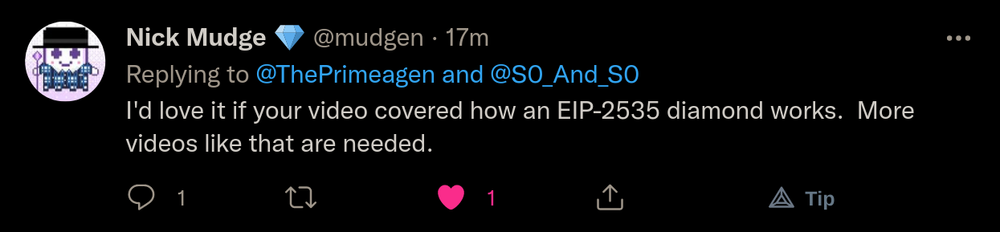

## The Year Of Crypto

 
 
 
 
 
 
 
 
 
 
 
 
 
 
 

## That's what I thought in 2017

 
 
 
 
 
 
 
 
 
 
 
 
 
 
 

## Slum Doge Millionaire

 
 
 
 
 
 
 
 
 
 
 
 
 
 
 

## Now you have me talking to you about crypto
Just excuse the lambo.

### Why am I doing this?
I am not going to sell you on anything.  I am not going to tell you that crypto
is 100% the future.  I have no idea what the future will be and crypto is a
very interesting topic to say the least.  From a personal stand point, I think
its just interesting.  I think every developer should at least play with it and
see how it goes.

 
 
 
 
 
 
 
 
 
 
 
 
 
 
 

### The goal of this course
The goal of this course is not to teach you something specific about a specific
platform, but instead to give you the foundation it requires to build
_anything_ you want on with ethereum.

There are plenty of other cool technologies out there that could easily be
used.  I personally am very excited about building something with solona.  I
think that it could be a real winner.

#### The Course Outline.
##### P1. The Foundation
* The "Hello, Universe" contract.
  * building a `HelloWorld` contract.
  * Testing It
  * Deploying it.
  * Communicating from the browser.

##### P2. Understanding Solidity
* A slightly more complex contract with reading and writing.

##### P3. Complex Contract
* Core concepts.
  * Arrays
  * Mappings
  * Bits
    * (0x1 << 3) - 1
    * We will get you good at bits.
  * Testing, Deploying, Communicating.

##### P4. Memory, Fallbacks -> Diamond Pattern
* Things we will a bit complicated here.  But it is a must for any developer.

TODO: Can I do this?
##### P5. Launch it?
* Launch on TestNet Rinkeby
  * Get metamask now please
  * Get Rinkeby now please: [Rinkeby Faucet](https://faucets.chain.link/rinkeby)
    * https://faucets.chain.link/rinkeby

 
 
 
 
 
 
 
 
 
 
 
 
 
 
 

### Ready?
We are going to something a bit different than the usual course.  We are going
to start by simply writing, deploying, and testing a contract.

#### Why code first?
I firmly believe that the best way to become good at anything is to do said
thing.  I could spend a significant amount of time going through the following:
* declaring variables
* if statements
* for loops
* inheritance

#### But No!
I would rather cover:
* How to deploy your contract, communicate with your contract from browser or
  node.
* Strategies for testing using inheritance.
* Memory layout

#### Some Basic Assumptions
* I assume you understand programming
* I assume you are mildly familiar with typescript and its echo system.

#### Why not use the ethereum IDE for dev?
I really think that it is best to understand your enviroment before you use
things that abstract it away from you.

 
 
 
 
 
 
 
 
 
 
 
 
 
 
 
