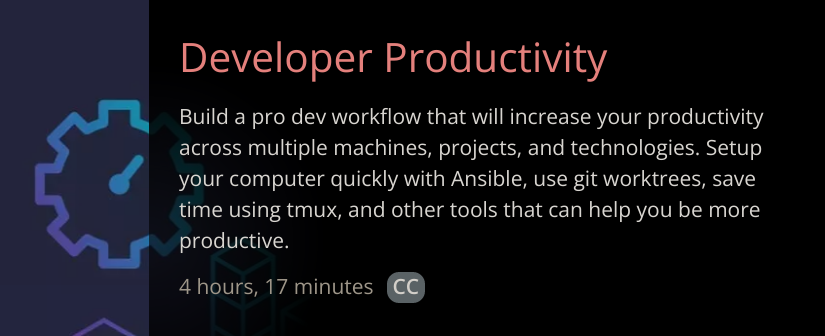

## Your First Contract

```
mkdir jpegdegens
cd jpegdegens
git init
yarn init -y
yarn add -D hardhat
npx hardhat
```

<br />
<br />
<br />
<br />
<br />
<br />
<br />
<br />
<br />
<br />
<br />
<br />
<br />
<br />

### Typical Structure
Before we create our first contract, lets talk about folder structure.
```
jpegdegens
  - contracts
    - YourContracs.sol
    ...
  - scripts
    - deploy.ts
    ...
  - test
    - sometest.js
    ...
```

<br />
<br />
<br />
<br />
<br />
<br />
<br />
<br />
<br />
<br />
<br />
<br />
<br />
<br />

### Don't forget the .gitignore

<br />
<br />
<br />
<br />
<br />
<br />
<br />
<br />
<br />
<br />
<br />
<br />
<br />
<br />


### Create first contract.
Create a file in contracts folder named HelloWorld.sol

#### .sol != shit out of luck
solidity, which is the programming language of ethereum.

#### Contract code
```
// SPDX-License-Identifier: Unlicense
pragma solidity ^0.8.0;

contract HelloWorld {
    function hello() public pure returns (string memory) {
        return "Hello, World";
    }
}
```

<br />
<br />
<br />
<br />
<br />
<br />
<br />
<br />
<br />
<br />
<br />
<br />
<br />
<br />

### Compile time
```
npx hardhat compile
```

<br />
<br />
<br />
<br />
<br />
<br />
<br />
<br />
<br />
<br />
<br />
<br />
<br />
<br />


#### Did you get an error?
Did you get this error?
```
Error HH606: The project cannot be compiled, see reasons below.

The Solidity version pragma statement in these files don't match any of the configured compilers in your config. Change the pragma or configure additional compiler versions in your hardhat config.

  * contracts/HelloWorld.sol (^0.8.0)

To learn more, run the command again with --verbose

Read about compiler configuration at https://hardhat.org/config
```


<br />
<br />
<br />
<br />
<br />
<br />
<br />
<br />
<br />
<br />
<br />
<br />
<br />
<br />

Fix the version and lets recompile.
```
npx hardhat compile
Compiling 1 file with 0.8.4
Compilation finished successfully
```

<br />
<br />
<br />
<br />
<br />
<br />
<br />
<br />
<br />
<br />
<br />
<br />
<br />
<br />

### We compiled... Now what?

<br />
<br />
<br />
<br />
<br />
<br />
<br />
<br />
<br />
<br />
<br />
<br />
<br />
<br />

# LETS TEST!!!!

```
yarn add -D @nomiclabs/hardhat-ethers ethers @nomiclabs/hardhat-waffle ethereum-waffle chai
```

### Typescript
```
yarn add --save-dev ts-node typescript
```

### Testing types
```
yarn add --save-dev chai @types/node @types/mocha @types/chai
```

Yes... its a lot of dependencies.

<br />
<br />
<br />
<br />
<br />
<br />
<br />
<br />
<br />
<br />
<br />
<br />
<br />
<br />

### Before we write a test there are some things to do.

1. hardhat.config.js -> hardhat.config.ts

    Or else this...
    ```
    ➜  jpegdegens git:(master) ✗ npx hardhat test

      0 passing (1ms)
    ```

1. add `import "@nomiclabs/hardhat-waffle";` to the top of `hardhat.config.ts`.

<br />
<br />
<br />
<br />
<br />
<br />
<br />
<br />
<br />
<br />
<br />
<br />
<br />
<br />

### Lets write a test!!!
one of the primary reasons why I love using hardhat so much is the fact that
there is a testing suite.

1. First create a test folder.
1. Second, create the test...

```typescript
import _ from "@nomiclabs/hardhat-ethers";

import { ethers } from "hardhat";
import { expect } from "chai";

describe("Hello World", () => {
    it("should get the hello world", async () => {
        const HW = await ethers.getContractFactory("HelloWorld");
        const hello = await HW.deploy();

        expect(await hello.hello()).to.equal("Hello, World");
    });
});
```

<br />
<br />
<br />
<br />
<br />
<br />
<br />
<br />
<br />
<br />
<br />
<br />
<br />
<br />

### Execute the test
```
npx hardhat test
```

<br />
<br />
<br />
<br />
<br />
<br />
<br />
<br />
<br />
<br />
<br />
<br />
<br />
<br />

You will see this in some of the hardhat.config.js files and its very
important.  It creates ethers as a global object and as something that can be
important AND with the appropriate methods on this.


```
➜  jpegdegens git:(master) ✗ npx hardhat test


  Testing that contract.
    ✓ should return a hello world (516ms)


  1 passing (519ms)
```

<br />
<br />
<br />
<br />
<br />
<br />
<br />
<br />
<br />
<br />
<br />
<br />
<br />
<br />


## A Break Point
### Build some foundation

Lets look at the test code one more time and ask the question, what happened?

<br />
<br />
<br />
<br />
<br />
<br />
<br />
<br />
<br />
<br />
<br />
<br />
<br />
<br />

#### Lets create a deploy script.
Lets create this into a deploy script that can actually deploy our contract
onto a network.

<br />
<br />
<br />
<br />
<br />
<br />
<br />
<br />
<br />
<br />
<br />
<br />
<br />
<br />

### Deploy it like so
```
npx hardhat run scripts/deploy.ts --network localhost
```

<br />
<br />
<br />
<br />
<br />
<br />
<br />
<br />
<br />
<br />
<br />
<br />
<br />
<br />

#### What the Error?
```
(node:394882) UnhandledPromiseRejectionWarning: HardhatError: HH108: Cannot connect to the network localhost.
Please make sure your node is running, and check your internet connection and networks config
    at HttpProvider._fetchJsonRpcResponse (/home/mpaulson/personal/yayayaya/node_modules/hardhat/src/internal/core/providers/http.ts:176:15)
    at processTicksAndRejections (internal/process/task_queues.js:94:5)
(node:394882) UnhandledPromiseRejectionWarning: Unhandled promise rejection. This error originated either by throwing inside of an async function without a catch block, or by rejecting a promise which was not handled with .catch(). (rejection id: 1)
(node:394882) [DEP0018] DeprecationWarning: Unhandled promise rejections are deprecated. In the future, promise rejections that are not handled will terminate the Node.js process with a non-zero exit code
```

<br />
<br />
<br />
<br />
<br />
<br />
<br />
<br />
<br />
<br />
<br />
<br />
<br />
<br />

### The Cloud
ITS SOMEONE ELSES COMPUTER...

<br />
<br />
<br />
<br />
<br />
<br />
<br />
<br />
<br />
<br />
<br />
<br />
<br />
<br />

#### Lets make one local now.
```
npx hardhat node
```

<br />
<br />
<br />
<br />
<br />
<br />
<br />
<br />
<br />
<br />
<br />
<br />
<br />
<br />

### Lets go deeper.
1. Lets inspect the our local network
1. Lets call our contract that is now deployed on the network.

<br />
<br />
<br />
<br />
<br />
<br />
<br />
<br />
<br />
<br />
<br />
<br />
<br />
<br />

### Lets go even deeper

<br />
<br />
<br />
<br />
<br />
<br />
<br />
<br />
<br />
<br />
<br />
<br />
<br />
<br />

### Some would say don't do it

<br />
<br />
<br />
<br />
<br />
<br />
<br />
<br />
<br />
<br />
<br />
<br />
<br />
<br />

### Some would beg me to just explain what happenened

<br />
<br />
<br />
<br />
<br />
<br />
<br />
<br />
<br />
<br />
<br />
<br />
<br />
<br />

### I say no, deeper we go

<br />
<br />
<br />
<br />
<br />
<br />
<br />
<br />
<br />
<br />
<br />
<br />
<br />
<br />

### Lets communicate from the browser.
1. Go and get the MetaMask Extension
1. Go and get a positive attitude
1. Go and consider watching my other courses on FEM

<br />
<br />
<br />
<br />
<br />
<br />
<br />
<br />
<br />
<br />
<br />
<br />
<br />
<br />

### Course on developer productivity...
Its awesome, Tmux, ansible, everything, etc. etc.



<br />
<br />
<br />
<br />
<br />
<br />
<br />
<br />
<br />
<br />
<br />
<br />
<br />
<br />

### Create an account
I'll give you a moment

<br />
<br />
<br />
<br />
<br />
<br />
<br />
<br />
<br />
<br />
<br />
<br />
<br />
<br />

### Import a test account into your metamask
* Copy any of the accounts from the initial output.
  * Consistent.  Meaning you can keep this in your account.
* Make sure metamask is pointed to "localhost"

<br />
<br />
<br />
<br />
<br />
<br />
<br />
<br />
<br />
<br />
<br />
<br />
<br />
<br />

### Ok, we are not going this deep.
I just wanted you to get that done.  Its important for later.

<br />
<br />
<br />
<br />
<br />
<br />
<br />
<br />
<br />
<br />
<br />
<br />
<br />
<br />

### Jokes on you
We are actually doing it. So copy this webpack config.
<br />
<br />
I'll do A lot of live coding, but not webpack config live coding.  No, Sir.

```javascript
const dotenv = require("dotenv");
dotenv.config();

const path = require("path");
const HtmlWebpackPlugin = require("html-webpack-plugin");
const webpack = require("webpack");

module.exports = {
    entry: "./src/index.ts", // bundle"s entry point
    output: {
        path: path.resolve(__dirname, "dist"), // output directory
        filename: "[name].js", // name of the generated bundle
    },
    resolve: {
        extensions: [".js", ".ts", ".json"],
    },

    mode: "development",

    module: {
        rules: [
            {
                test: /\.ts$/,
                loader: "ts-loader",
                exclude: /node_modules/,
            },

            {
                test: /\.css$/i,
                use: ["style-loader", "css-loader"],
            },
        ],
    },
    plugins: [
        new HtmlWebpackPlugin({
            template: "./src/index.html",
            inject: "body",
        }),
        new webpack.DefinePlugin({
            'process.env.CONTRACT_ADDRESS': JSON.stringify(process.env.CONTRACT_ADDRESS),
            'process.env.DEBUG': JSON.stringify(process.env.DEBUG),
        }),
    ],

    watch: true,

    devServer: {
        historyApiFallback: true,
        contentBase: './',
        watchOptions: {
            aggregateTimeout: 300,
            poll: 1000
        }
    }
};
```

You also need some dependencies
```
yarn add -D webpack webpack-cli ts-loader html-webpack-plugin dotenv
```

You will also need this, `tsconfig.json`
```json
{
    "compilerOptions": {
        "resolveJsonModule": true,
        "esModuleInterop": true,
    }
}
```

<br />
<br />
<br />
<br />
<br />
<br />
<br />
<br />
<br />
<br />
<br />
<br />
<br />
<br />

### Complete code
```typescript
import { ethers } from "ethers";

async function hasSigners(): Promise<boolean> {
    //@ts-ignore
    const metamask = window.ethereum;
    const signers = await (metamask.request({method: 'eth_accounts'}) as Promise<string[]>);
    return signers.length > 0;
}

async function requestAccess(): Promise<boolean> {
    //@ts-ignore
    const result = (await window.ethereum.request({ method: 'eth_requestAccounts' })) as string[];
    return result && result.length > 0;
}

async function getContract() {
    const address = process.env.CONTRACT_ADDRESS;

    if (!(await hasSigners()) && !(await requestAccess())) {
        console.log("You are in trouble, no one wants to play");
    }

    // @ts-ignore
    const provider = new ethers.providers.Web3Provider(window.ethereum)
    const contract = new ethers.Contract(
        address,
        [
            "function helloWorld() public pure returns(string memory)",
        ], // abi
        provider
    );

    console.log("We have done it, time to call");
    console.log(await contract.helloWorld());
}


getContract();
```

<br />
<br />
<br />
<br />
<br />
<br />
<br />
<br />
<br />
<br />
<br />
<br />
<br />
<br />

### There are a few gaps in your knowledge
lets start filling it out.

<br />
<br />
<br />
<br />
<br />
<br />
<br />
<br />
<br />
<br />
<br />
<br />
<br />
<br />

