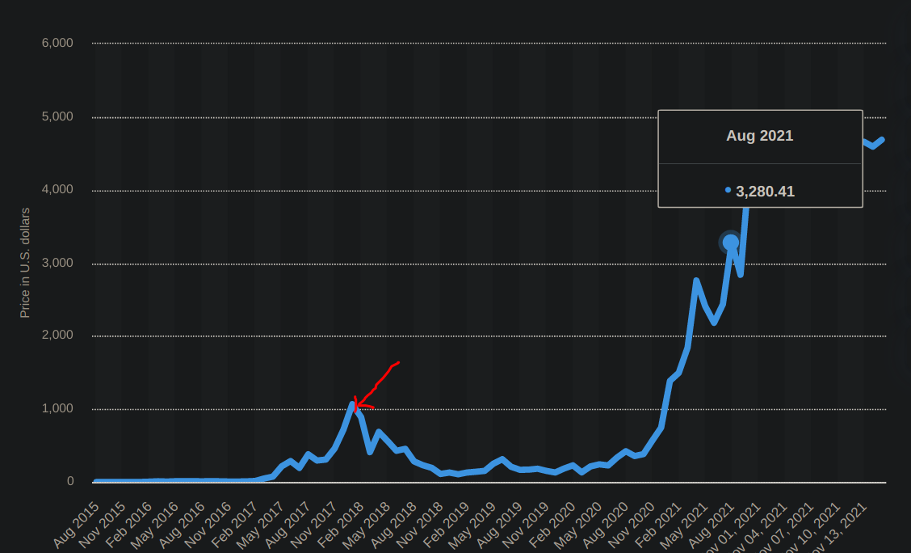
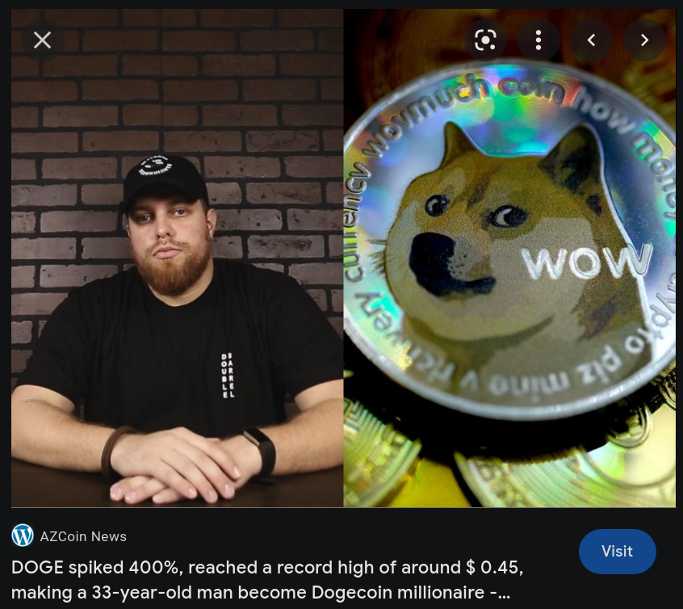

## The Year Of Crypto

 
 
 
 
 
 
 
 
 
 
 
 
 
 
 

## That's what I thought in 2017

 
 
 
 
 
 
 
 
 
 
 
 
 
 
 

## Slum Doge Millionaire

 
 
 
 
 
 
 
 
 
 
 
 
 
 
 

## Now you have me talking to you about crypto
Just excuse the lambo.

### Why am I doing this?
I am not going to sell you on anything.  I am not going to tell you that crypto
is 100% the future.  I have no idea what the future will be and crypto is a
very interesting topic to say the least.  From a personal stand point, I think
its just interesting.  I think every developer should at least play with it and
see how it goes.
